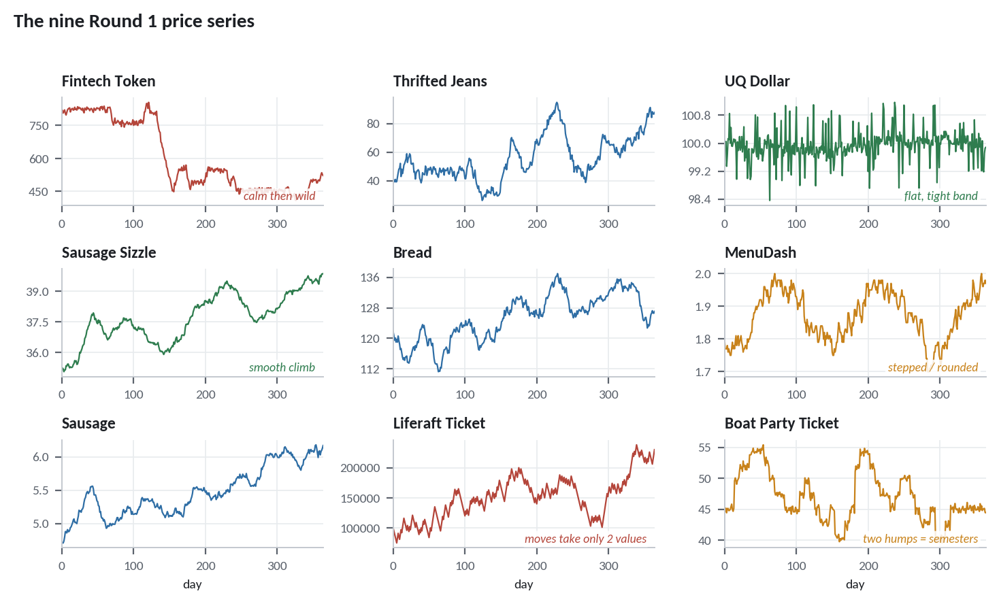
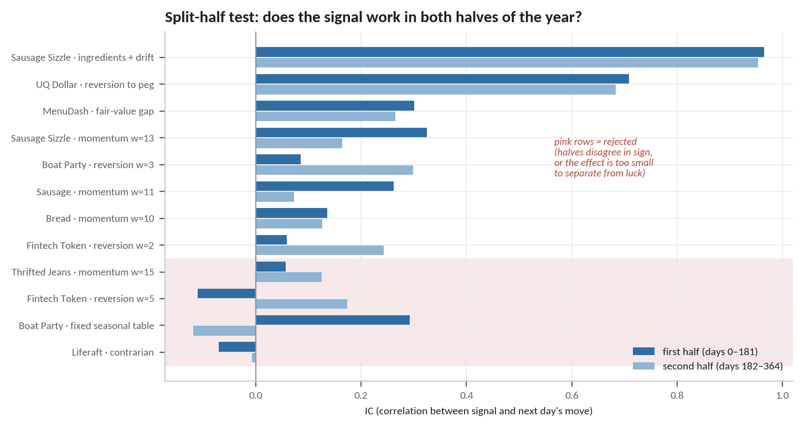
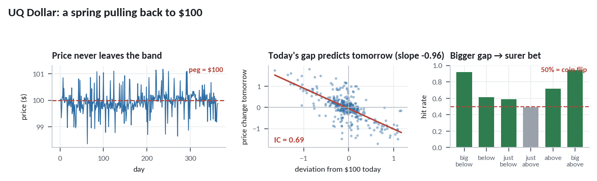
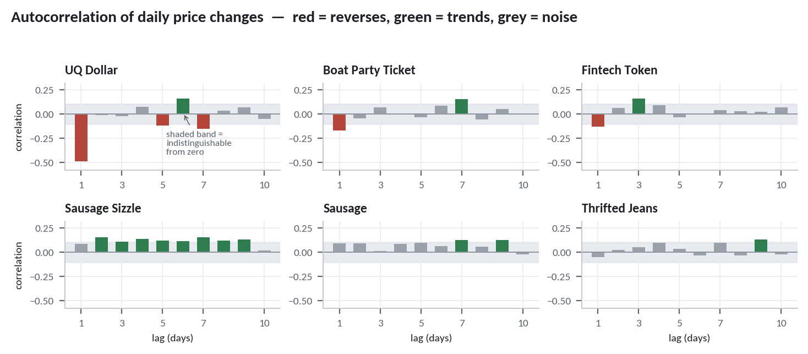
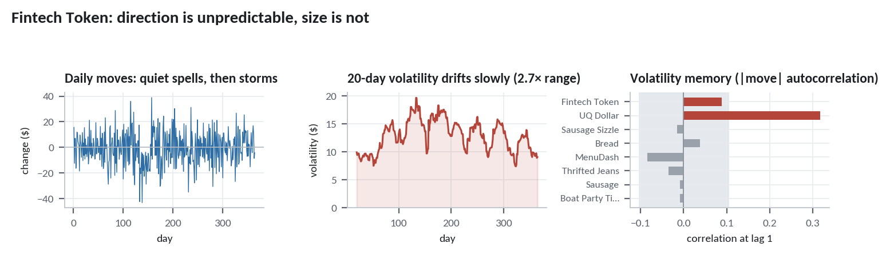
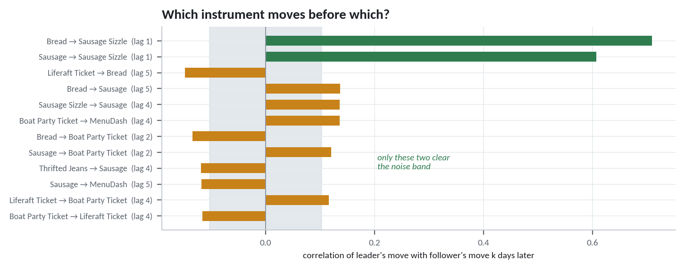
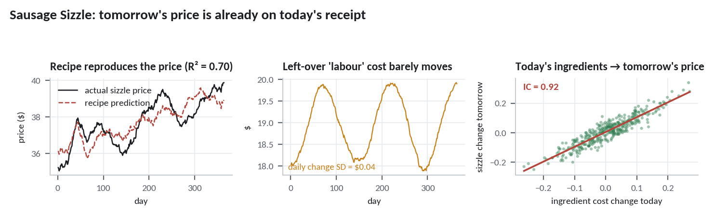
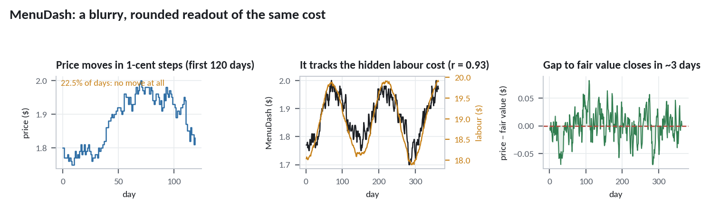
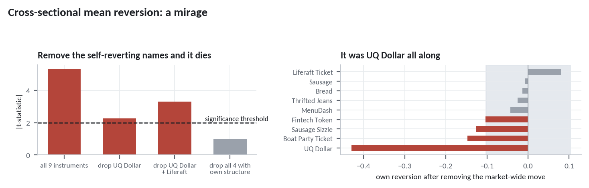
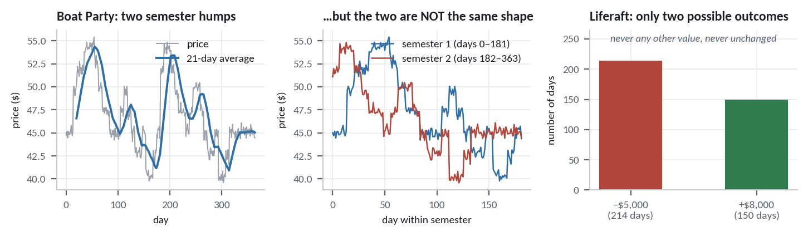

<div class="howto">

**How to read this report.** Every section is built in four layers, and you can
stop at whichever one you need.

<div class="legend">
<p><span class="chip chip-plain">In plain English</span> What the test is asking, using no notation. If you read only these, you will still follow the whole argument.</p>
<p><span class="chip chip-math">The maths</span> The formula, with every symbol defined and — where it isn't obvious — where the formula comes from.</p>
<p><span class="chip chip-worked">Worked example</span> The same arithmetic done on our actual data, so you can check it by hand.</p>
<p><span class="chip chip-take">What it means for trading</span> The decision the result leads to.</p>
</div>

Nothing here is illustrative. Every figure, table and worked example is generated
from the Round 1 CSVs by the scripts listed in Appendix C.

</div>

## Executive summary

We were given one simulated year — 365 days of prices for nine instruments — and
asked to find whatever structure is hiding in it, so we can bet on the second
year we've never seen.

The honest headline is that **most of the board is noise**. Five of the nine
instruments behave close to a coin flip from one day to the next. But three of
them are not random at all, and two of those are extremely predictable:

<div class="summary-cards">

<div class="card card-gold">
<div class="card-rank">Strongest edge</div>
<h4>Sausage Sizzle</h4>
<p>Its price is a <em>recipe</em>: bread and sausage prices from yesterday, plus a
slow-moving labour cost. Since today's bread and sausage prices are already
printed, tomorrow's sizzle price is largely knowable today. Correlation between
our forecast and what actually happens: <strong>0.96</strong>. We get the
direction right <strong>83%</strong> of the time.</p>
</div>

<div class="card card-silver">
<div class="card-rank">Second strongest</div>
<h4>UQ Dollar</h4>
<p>Pinned to $100 by something that acts like a spring. Whenever it drifts away
it is yanked back — and it reverts almost fully in a single day. Correlation
between today's gap and tomorrow's move: <strong>0.69</strong>. When the gap is
large we are right <strong>92–95%</strong> of the time.</p>
</div>

<div class="card card-bronze">
<div class="card-rank">Third</div>
<h4>MenuDash</h4>
<p>A blurry, rounded readout of the same hidden labour cost that the sizzle
reveals exactly. When the two disagree, MenuDash closes the gap within about
three days. Correlation: <strong>0.28</strong>.</p>
</div>

</div>

Beyond those, Boat Party Ticket, Bread, Sausage and Fintech Token each carry a
small but real edge (correlations of 0.13 to 0.21). Thrifted Jeans and Liferaft
Ticket carry none we could verify.

**Three findings contradict what the current algorithm assumes**, and each would
cost money in Round 2:

<div class="flags">

1. **Fintech Token's signal is fitted to noise.** The algorithm averages 5-, 7-
   and 10-day reversion windows. All three work in one half of the year and fail
   in the other — they flip sign. Only a 1–2 day window survives.

2. **The hard-coded Boat Party seasonal calendar does not transfer.** Fitting the
   day-of-year shape on the first half of Round 1 and applying it to the second
   half gives a correlation of **−0.12** — it points the wrong way. Round 1
   contains two semesters and they are not copies of each other.

3. **Liferaft Ticket has no history to learn from.** Its price moves take exactly
   two values, ±$5,000 and +$8,000, because it is a voting payoff rather than a
   price. Round 1's path records what Round 1's room did; it says nothing about
   Round 2's room. The contrarian rule tests at a correlation of −0.04, which is
   indistinguishable from zero.

</div>

We also tested for **cross-sectional mean reversion** — the idea that today's
biggest winner tends to be tomorrow's loser. At first glance it looks strongly
present. It isn't. The apparent effect is one instrument (UQ Dollar) leaking into
the panel statistic. Remove it and the effect disappears. **Do not build a
rank-and-reverse book.**

---

## Part I · The problem, and the one number that measures success

### 1. What we are actually trying to do

Nine instruments trade for 365 days. Each day we choose how many units of each to
hold — long (betting the price rises) or short (betting it falls) — subject to
per-instrument limits and a $600,000 total budget. We are then scored on a
*second* year we never get to see.

So this is not a question of "what happened in Round 1". It is: **what mechanism
generated Round 1, and will that mechanism still be running in Round 2?**

That distinction drives everything below. A pattern that describes Round 1
perfectly but has no mechanism behind it is worse than useless, because we will
bet real budget on it.

<figure>

<figcaption><strong>Figure 1.</strong> The nine Round 1 price series. Even by eye
the board splits into groups: UQ Dollar is pinned flat inside a band of about
±$1.60; Sausage Sizzle climbs smoothly; MenuDash moves in visible steps; Boat
Party has two clear humps; Fintech Token has calm stretches and violent ones.
Liferaft drifts upward like the others here, but that is an artefact of the
scale — its daily change only ever takes two values, which §19 unpacks. Each of
these visual impressions turns into a specific statistical test below.</figcaption>
</figure>

### 2. The Information Coefficient — how we score every idea

<div class="plain">
<span class="chip chip-plain">In plain English</span>

Every trading idea, no matter how it's dressed up, boils down to producing one
number each morning: a **signal**. Positive means "I think this goes up today",
negative means "I think it goes down", and bigger means "I'm more confident".

There is one obvious way to grade such a thing: line up all 365 of your signals
next to what the price actually did the following day, and measure how well they
move together. That measure is the correlation between the two, and in finance it
has a name — the **Information Coefficient**, or IC.

An IC of 0 means your signal is worthless. An IC of 1 means you are psychic. Real
tradeable signals in real markets typically live between 0.02 and 0.10; anything
above 0.3 would be extraordinary. As we'll see, this competition's data is far
more forgiving than a real market.
</div>

<div class="math">
<span class="chip chip-math">The maths</span>

For a signal <i>s<sub>t</sub></i> computed on day <i>t</i> using only information
available on day <i>t</i>, and the price change <i>r</i><sub>t+1</sub> =
<i>P</i><sub>t+1</sub> − <i>P<sub>t</sub></i> that follows:

<div class="eq">
IC = corr(<i>s<sub>t</sub></i>, <i>r</i><sub>t+1</sub>) =
<span class="frac"><span class="num">Σ<sub>t</sub> (<i>s<sub>t</sub></i> − <i>s̄</i>)(<i>r</i><sub>t+1</sub> − <i>r̄</i>)</span><span class="den">√[ Σ<sub>t</sub> (<i>s<sub>t</sub></i> − <i>s̄</i>)² · Σ<sub>t</sub> (<i>r</i><sub>t+1</sub> − <i>r̄</i>)² ]</span></span>
</div>

<div class="where">
<p><i>s̄</i>, <i>r̄</i> — the averages of the signal and of the next-day change.</p>
<p>The numerator asks: when the signal is above its average, is the next move also
above <em>its</em> average? The denominator just rescales the answer onto
[−1, +1] so the units cancel and we can compare across instruments.</p>
</div>

**The critical detail is the subscript.** The signal carries <i>t</i>, the return
carries <i>t</i>+1. If any quantity dated <i>t</i>+1 or later sneaks into
<i>s<sub>t</sub></i>, the IC becomes meaningless — you are measuring how well
tomorrow predicts tomorrow. This is called *lookahead bias*, and §14 documents a
case where we walked straight into it.

**Turning an IC into a verdict.** A correlation measured on a finite sample is
itself uncertain. Under the null hypothesis that the true correlation is zero,

<div class="eq">
<i>t</i> = IC · <span class="frac"><span class="num">√(<i>n</i> − 2)</span><span class="den">√(1 − IC²)</span></span>
</div>

follows a <i>t</i>-distribution with <i>n</i> − 2 degrees of freedom. The
conventional threshold is |<i>t</i>| > 2, which for large <i>n</i> corresponds to
roughly a 5% chance of seeing an effect this large from pure luck.

Rearranged, that gives the useful rule of thumb: with <i>n</i> observations,
anything smaller than <b>1.96 / √<i>n</i></b> is not distinguishable from noise.
</div>

<div class="worked">
<span class="chip chip-worked">Worked example</span>

We have <i>n</i> = 365 days, so our noise floor is

<div class="eq">1.96 / √364 = <b>0.103</b></div>

Any IC below about 0.10 in this report should be treated as zero. Converting a few
of our actual results:

| Signal | IC | n | t = IC·√(n−2)/√(1−IC²) | Verdict |
|---|---|---|---|---|
| Sizzle: ingredients + drift | 0.9601 | 353 | 64.3 | overwhelming |
| UQ Dollar: reversion to peg | 0.6975 | 348 | 18.1 | overwhelming |
| MenuDash: fair-value gap | 0.2801 | 284 | 4.90 | strong |
| Fintech: 2-day reversion | 0.1327 | 363 | 2.54 | marginal |
| Thrifted Jeans: momentum | 0.0971 | 350 | 1.82 | not significant |

Thrifted Jeans is the instructive one. An IC of 0.097 *looks* like a real
pattern — but on 350 observations, a worthless signal produces something that
large about 7% of the time by chance alone. That is not a standard we would bet
budget on.
</div>

### 3. The split-half test — our defence against fooling ourselves

<div class="plain">
<span class="chip chip-plain">In plain English</span>

Here is the trap that ruins most backtests. We tried dozens of signal variants
per instrument — reversion over 2 days, 3 days, ... 40 days, momentum over each
of those, and so on. If you try forty things on random data, one or two will look
brilliant purely by accident. Report the best one and you have discovered
nothing except your own persistence.

The cheapest honest defence: **cut the year in half.** Measure the signal
separately on days 0–181 and on days 182–364. A real mechanism should show up in
both. A lucky accident usually shows up in one and vanishes — or reverses — in
the other.

We required both halves to have the *same sign* and the full-sample <i>t</i> to
exceed 2. This is a weaker check than a true out-of-sample test on data we've
never touched — we can't do that, since Round 2 is hidden — but it catches the
worst offenders, and it caught three.
</div>

<figure>

<figcaption><strong>Figure 2.</strong> Every signal we considered, scored
separately on each half of the year. The eight signals at the top hold up. The
four in pink do not: Fintech's 5-day reversion and the Boat Party seasonal
calendar actually <em>reverse sign</em> between halves, which is the signature of
a pattern fitted to noise. Thrifted Jeans keeps its sign but is too weak to
separate from luck.</figcaption>
</figure>

<div class="takeaway">
<span class="chip chip-take">What it means for trading</span>

Three signals currently in `algorithm.py` fail this test. Sections 12, 14 and 15
deal with each in turn. Every other recommendation in this report cleared it.
</div>

---

## Part II · Does each series have structure at all?

Before asking *which* pattern an instrument follows, we should ask whether it
follows any. Two tests answer that, and they approach it from opposite directions.

### 4. Stationarity — does the price have a home to return to?

<div class="plain">
<span class="chip chip-plain">In plain English</span>

Picture two objects. The first is a **balloon released outdoors**: it drifts, and
where it goes next depends on where it is now, but it has no home. Knowing it is
currently high tells you nothing about whether it will come down. The second is a
**weight hanging on a spring**: push it anywhere you like and it gets pulled back
to a fixed resting point, harder the further you push.

The balloon is a *random walk*. The spring is *mean-reverting*, or in the jargon
*stationary*. This is the single most important thing to know about a price
series, because it tells you which direction to bet after a large move — with it,
or against it.

The test works by measuring the pull. Take each day's price change and ask: is it
related to how far the price was from the average yesterday? For a balloon, no
relationship. For a spring, a strongly negative one — high yesterday means a fall
today.
</div>

<div class="math">
<span class="chip chip-math">The maths</span>

Fit the regression (this is the core of the **Augmented Dickey–Fuller test**):

<div class="eq">
Δ<i>P<sub>t</sub></i> = <i>a</i> + <i>b</i> <i>P</i><sub>t−1</sub> + <i>ε<sub>t</sub></i>,
&nbsp;&nbsp; where Δ<i>P<sub>t</sub></i> = <i>P<sub>t</sub></i> − <i>P</i><sub>t−1</sub>
</div>

<div class="where">
<p><i>b</i> — the pull. This is the number that matters.</p>
<p><i>a</i> — an intercept, which combined with <i>b</i> locates the resting point.</p>
<p><i>ε<sub>t</sub></i> — the unpredictable shock on day <i>t</i>.</p>
</div>

If <i>b</i> = 0 the change doesn't depend on the level at all: a random walk. If
<i>b</i> < 0, being high causes a fall — a spring. The ADF test asks whether <i>b</i>
is significantly below zero; a **p-value below 0.05 means mean-reverting**.

Rewriting the same equation makes its meaning clearer. Setting
<i>κ</i> = −<i>b</i> and <i>μ</i> = −<i>a</i>/<i>b</i>:

<div class="eq">
Δ<i>P<sub>t</sub></i> = <i>κ</i>(<i>μ</i> − <i>P</i><sub>t−1</sub>) + <i>ε<sub>t</sub></i>
</div>

which reads directly as *"each day, move a fraction <i>κ</i> of the way back
toward the resting level <i>μ</i>"*. This is the discrete-time
**Ornstein–Uhlenbeck process**, the standard model for anything that reverts to a
level.

**Deriving the half-life.** Ignore the shocks for a moment. If the gap from the
resting point today is <i>g<sub>t</sub></i> = <i>P<sub>t</sub></i> − <i>μ</i>, the
equation says <i>g</i><sub>t+1</sub> = (1 − <i>κ</i>)<i>g<sub>t</sub></i>, so after
<i>h</i> days the gap is (1 − <i>κ</i>)<sup><i>h</i></sup><i>g</i><sub>0</sub>.
Ask when half the gap is gone:

<div class="eq">
(1 − <i>κ</i>)<sup><i>h</i></sup> = ½ &nbsp;⟹&nbsp;
<i>h</i> = <span class="frac"><span class="num">ln ½</span><span class="den">ln(1 − <i>κ</i>)</span></span>
≈ <span class="frac"><span class="num">ln 2</span><span class="den"><i>κ</i></span></span> &nbsp;(for small <i>κ</i>)
</div>

The **half-life** is the natural way to report reversion speed: it is how many
days it takes to close half the gap, and it tells you directly how long you'd hold
the trade.
</div>

<div class="worked">
<span class="chip chip-worked">Worked example — UQ Dollar</span>

Running that regression on all 364 daily changes:

<div class="eq">
Δ<i>P<sub>t</sub></i> = 96.190 − 0.9625 <i>P</i><sub>t−1</sub>
&nbsp;&nbsp;(<i>t</i> on the slope = −18.3)
</div>

So <i>κ</i> = 0.9625 and <i>μ</i> = 96.190 / 0.9625 = **99.941**.

Two things fall out. First, the resting point is $99.94 — essentially the $100 peg
the instrument specification describes, recovered from the data alone. Second,
<i>κ</i> = 0.96 means the price closes **96% of any gap in a single day**. The
half-life is ln 2 / 0.9625 = **0.72 days**.

That is extraordinarily fast. A typical mean-reverting pair in a real market has
a half-life of weeks. This one is essentially fully reverted by tomorrow's close.
</div>

<figure>

<figcaption><strong>Figure 3.</strong> Left: the price never escapes a band of
about ±$1.60 around $100 in the whole year. Middle: each dot is one day — the
horizontal axis is how far the price sat from $100, the vertical axis is what it
did the next day. The relationship is close to a straight line with slope −0.96,
which is exactly the spring constant we fitted. Right: the further from the peg,
the more reliable the bet — from a coin flip when the gap is tiny to a 92–95% hit
rate when it is large.</figcaption>
</figure>

<div class="warn-soft">

**A note on the p-values.** UQ Dollar's ADF p-value is 0.103 — technically above
the 0.05 threshold, which would normally mean "cannot reject a random walk". Do
not be misled. The ADF test on 365 observations has low power, and every other
piece of evidence (κ = 0.96 with t = −18.3, ACF(1) = −0.49, Hurst = 0.008,
variance ratio = 0.11) points the same way with overwhelming force. **When a
single test disagrees with five others, the single test is usually the one with
the problem.** We report the p-value for completeness and ignore it.

</div>

### 5. The Hurst exponent — wandering versus snapping back

<div class="plain">
<span class="chip chip-plain">In plain English</span>

Here is a second, cleverer way to ask the same question, and it needs no
regression at all.

Take a series and measure how far it typically travels in 2 days. Then in 20 days.
For a **balloon**, the distances grow like the square root of time — travel 10×
longer and you get about √10 ≈ 3.2× further. This is the same square-root law
that governs a drunkard's walk, and it is what pure randomness looks like.

Now: if the series is a **spring**, it can't get far no matter how long you wait,
because it keeps getting hauled back. Distance barely grows at all. And if the
series **trends**, each step tends to continue the last, so distance grows
*faster* than square-root.

Measuring how fast distance grows with time therefore diagnoses the series in one
number.
</div>

<div class="math">
<span class="chip chip-math">The maths</span>

For each lag <i>ℓ</i>, compute the standard deviation of the <i>ℓ</i>-day change:

<div class="eq">
<i>τ</i>(<i>ℓ</i>) = sd( <i>P</i><sub>t+<i>ℓ</i></sub> − <i>P<sub>t</sub></i> )
</div>

The claim is that this scales as a power law, <i>τ</i>(<i>ℓ</i>) ∝
<i>ℓ</i><sup><i>H</i></sup>. Taking logs turns that into a straight line:

<div class="eq">
ln <i>τ</i>(<i>ℓ</i>) = <i>H</i> · ln <i>ℓ</i> + constant
</div>

so <i>H</i> — the **Hurst exponent** — is just the slope of a log-log plot, which
we estimate by least squares over <i>ℓ</i> = 2 … 39.

<div class="where">
<p><i>H</i> = 0.5 — random walk. Distance grows as √time.</p>
<p><i>H</i> < 0.5 — mean-reverting. The lower, the tighter the leash.</p>
<p><i>H</i> > 0.5 — trending. Moves tend to continue.</p>
</div>
</div>

<div class="worked">
<span class="chip chip-worked">Worked example</span>

| Instrument | sd of 2-day change | sd of 20-day change | ratio | H |
|---|---|---|---|---|
| *a pure random walk would give* | — | — | *3.16* | *0.50* |
| UQ Dollar | 0.602 | 0.638 | **1.06** | **0.008** |
| Thrifted Jeans | 3.818 | 15.219 | 3.99 | 0.576 |
| Sausage Sizzle | 0.143 | 0.758 | **5.32** | **0.719** |

UQ Dollar travels **no further in 20 days than it does in 2** — the ratio is 1.06
where randomness demands 3.16. That is about as strong a mean-reversion signature
as this statistic can produce.

Sausage Sizzle goes the other way, travelling 5.3× rather than 3.2×. But be
careful how you read that: its H of 0.72 reflects the slow upward march of
ingredient costs, not a tradeable tendency for moves to continue. **A trending
*cause* is not the same as a trending *signal*** — §11 shows the far better way
to trade it.

Thrifted Jeans at 3.99 versus 3.16 is close enough to random to be treated as
random.
</div>

### 6. Structural results for all nine

<div class="tbl-note">Half-life is from the OU fit; a value in the tens or
hundreds of days on a one-year sample means "no meaningful reversion". Drift
<i>t</i> tests whether the average daily change differs from zero.</div>

| Instrument | ADF p | Hurst | Half-life | Drift t | Ann. vol | What it is |
|---|---|---|---|---|---|---|
| UQ Dollar | 0.10 | **0.008** | **0.72d** | −0.01 | 9.5% | Hard peg — a spring at $100 |
| Sausage Sizzle | 0.49 | 0.72 | 152d | 2.52 | 4.1% | Deterministic cost function |
| MenuDash | 0.16 | 0.52 | 22d | 0.47 | 16.0% | Rounded readout of that cost |
| Boat Party | 0.07 | 0.55 | 21d | −0.03 | 34.8% | Seasonal trend + overreaction |
| Fintech Token | 0.56 | 0.58 | 129d | −1.11 | 37.8% | Random walk, volatility regimes |
| Bread | 0.40 | 0.51 | 66d | 0.32 | 11.2% | Random walk, weak trend |
| Sausage | 0.84 | 0.56 | 134d | 2.23 | 9.9% | Drifting random walk |
| Thrifted Jeans | 0.15 | 0.58 | 59d | 0.90 | 86.1% | Drifting random walk |
| Liferaft | — | 0.45 | — | 1.06 | 73.8% | Not a price process (§15) |

Two entries deserve a second look.

**Thrifted Jeans gained 119% over the year** — the best performer on the board —
yet its drift <i>t</i> is only 0.90. How can such a large gain not be significant?
Because its annualised volatility is 86%. A series that swings that violently can
produce a 119% year by luck without any genuine upward tendency. One year is
simply not enough data to tell a real drift from a fortunate random walk. Betting
on it is a bet, not a signal — and we label it as such.

**Boat Party's ADF p-value of 0.07** is close to significant, but the reversion it
picks up is the seasonal shape returning to its own average, not something we can
trade at the daily horizon. §14 finds what *is* tradeable there.

<div class="takeaway">
<span class="chip chip-take">What it means for trading</span>

Only UQ Dollar earns a genuine mean-reversion model from these tests. Sausage
Sizzle earns a *cost* model rather than a price model. The other seven are
random-walk-like at the level of the price itself, which means any edge in them
must come from somewhere other than the price's own history — from a related
instrument, from the size of moves rather than their direction, or from a
short-horizon overreaction.
</div>

---

## Part III · Memory in direction

### 7. Autocorrelation — does yesterday's move predict today's?

<div class="plain">
<span class="chip chip-plain">In plain English</span>

The previous section asked about the price *level*. This one asks about the
*moves*. If the price rose yesterday, does that tell us anything about today?

Three answers are possible. **Positive autocorrelation** means moves tend to
continue — a rise makes another rise more likely. Traders call this momentum.
**Negative autocorrelation** means moves tend to reverse — a rise makes a fall
more likely. That is overreaction: the price jumped too far and is coming back.
**Zero** means yesterday tells you nothing, which is the normal state of affairs
in an efficient market.

Autocorrelation is just the correlation of the series with a shifted copy of
itself. Do it at a shift of 1 day, 2 days, and so on, and you get a picture of how
long the memory lasts.
</div>

<div class="math">
<span class="chip chip-math">The maths</span>

With daily changes <i>r<sub>t</sub></i> and their mean <i>r̄</i>, the
autocorrelation at lag <i>k</i> is

<div class="eq">
<i>ρ</i>(<i>k</i>) =
<span class="frac"><span class="num">Σ<sub><i>t</i>=<i>k</i>+1</sub><sup><i>n</i></sup> (<i>r<sub>t</sub></i> − <i>r̄</i>)(<i>r</i><sub><i>t−k</i></sub> − <i>r̄</i>)</span><span class="den">Σ<sub><i>t</i>=1</sub><sup><i>n</i></sup> (<i>r<sub>t</sub></i> − <i>r̄</i>)²</span></span>
</div>

Note this is exactly the IC formula from §2 with the signal set to "yesterday's
move". Autocorrelation *is* an IC — it scores the simplest possible signal.

Under the null that the series is random, <i>ρ</i>(<i>k</i>) is approximately
Normal with standard deviation 1/√<i>n</i>, giving the familiar **noise band of
±1.96/√<i>n</i>** drawn on every autocorrelation plot.

To test several lags at once rather than cherry-picking the best, the
**Ljung–Box** statistic pools them:

<div class="eq">
<i>Q</i>(<i>m</i>) = <i>n</i>(<i>n</i>+2) Σ<sub><i>k</i>=1</sub><sup><i>m</i></sup>
<span class="frac"><span class="num"><i>ρ</i>(<i>k</i>)²</span><span class="den"><i>n</i> − <i>k</i></span></span>
&nbsp;~&nbsp; <i>χ</i>²<sub><i>m</i></sub>
</div>

A small p-value means "the first <i>m</i> lags contain more structure than chance
allows", without our having had to choose <i>m</i> after seeing the data.
</div>

<div class="worked">
<span class="chip chip-worked">Worked example — UQ Dollar's ρ(1) by hand</span>

Across <i>n</i> = 364 daily changes, mean change <i>r̄</i> = −0.00033:

<div class="eq">
Σ (<i>r<sub>t</sub></i> − <i>r̄</i>)(<i>r</i><sub>t−1</sub> − <i>r̄</i>) = −63.53
&nbsp;&nbsp;&nbsp; Σ (<i>r<sub>t</sub></i> − <i>r̄</i>)² = 129.23
</div>
<div class="eq">
<i>ρ</i>(1) = −63.53 / 129.23 = <b>−0.4916</b>
</div>

against a noise band of ±1.96/√364 = ±0.103. The value is nearly five times the
band. Practically, ρ(1) = −0.49 says that **about half of any day's move is
undone the very next day.**
</div>

<figure>

<figcaption><strong>Figure 4.</strong> Autocorrelation of daily changes at lags 1
to 10 for six instruments. The grey band is the noise floor — bars inside it are
indistinguishable from zero. Red bars below the band mean moves reverse; green
bars above it mean moves continue. UQ Dollar's lag-1 bar is enormous and
negative. Boat Party and Fintech Token show milder overreaction. Sausage Sizzle
shows the opposite sign. Thrifted Jeans shows nothing at any lag.</figcaption>
</figure>

### 8. Variance ratios — the same question at every horizon

<div class="plain">
<span class="chip chip-plain">In plain English</span>

Autocorrelation looks at one lag at a time, which makes it easy to miss a pattern
that is spread thinly across many lags. The variance ratio test aggregates.

The idea reuses the drunkard's walk. If moves are independent, then the variance
of a 10-day move should be exactly 10× the variance of a 1-day move — variances
of independent things add up. So compute both and take the ratio. Getting 10 back
means random. Getting less than 10 means the moves partly cancelled each other,
which is reversion. More than 10 means they reinforced, which is trend.

Dividing through by the horizon makes the benchmark 1 instead of 10, which is how
the statistic is conventionally reported.
</div>

<div class="math">
<span class="chip chip-math">The maths</span>

The **Lo–MacKinlay variance ratio** at horizon <i>q</i>:

<div class="eq">
VR(<i>q</i>) =
<span class="frac"><span class="num">(1/<i>q</i>) · Var(<i>q</i>-day change)</span><span class="den">Var(1-day change)</span></span>
</div>

Estimated with the standard unbiased corrections, where
<i>μ̂</i> = <i>r̄</i> and <i>m</i> = <i>q</i>(<i>n</i>−<i>q</i>+1)(1 − <i>q</i>/<i>n</i>):

<div class="eq">
<i>σ̂</i>²<sub>1</sub> = <span class="frac"><span class="num">1</span><span class="den"><i>n</i>−1</span></span> Σ<sub><i>t</i></sub> (<i>r<sub>t</sub></i> − <i>μ̂</i>)²
&nbsp;&nbsp;&nbsp;
<i>σ̂</i>²<sub><i>q</i></sub> = <span class="frac"><span class="num">1</span><span class="den"><i>m</i></span></span> Σ<sub><i>t</i></sub> ( Σ<sub><i>j</i>=0</sub><sup><i>q</i>−1</sup> <i>r</i><sub><i>t−j</i></sub> − <i>q μ̂</i> )²
</div>

<div class="eq">VR(<i>q</i>) = <i>σ̂</i>²<sub><i>q</i></sub> / <i>σ̂</i>²<sub>1</sub></div>

The connection to §7 is exact and worth stating, because it shows VR is not a new
idea but a weighted sum of the autocorrelations we already have:

<div class="eq">
VR(<i>q</i>) = 1 + 2 Σ<sub><i>k</i>=1</sub><sup><i>q</i>−1</sup>
(1 − <i>k</i>/<i>q</i>) <i>ρ</i>(<i>k</i>)
</div>

So VR simply adds up the autocorrelations with declining weights. Many small
negative ρ's that individually look like noise will together push VR clearly below 1.
</div>

<div class="worked">
<span class="chip chip-worked">Worked example — UQ Dollar</span>

<div class="eq">
Var(1-day change) = 0.3560 &nbsp;&nbsp;&nbsp; Var(2-day change) = 0.1820
</div>

If moves were independent, the 2-day variance would be 2 × 0.3560 = 0.7120. It is
0.1820 — about **a quarter** of what randomness predicts. Dividing by the horizon:

<div class="eq">VR(2) = 0.1820 / 0.3560 = <b>0.511</b></div>

And it keeps falling as the horizon grows: VR(5) = 0.214, VR(10) = 0.109,
VR(20) = 0.060. By 20 days the price has accumulated just 6% of the variance a
random walk would have. It is going nowhere, extremely reliably.
</div>

### 9. Autocorrelation results

| Instrument | ρ(1) | ρ(2) | Ljung–Box p (10 lags) | VR(10) | Reading |
|---|---|---|---|---|---|
| UQ Dollar | **−0.492** | −0.012 | <0.001 | **0.109** | Violent 1-day reversion |
| Boat Party | **−0.168** | −0.043 | 0.002 | 0.890 | Overreaction |
| Fintech Token | **−0.132** | 0.064 | 0.008 | 1.257 | Weak 1-day reversion |
| Sausage Sizzle | 0.085 | **0.155** | <0.001 | **2.183** | Trend (inherited from cost) |
| Sausage | 0.091 | 0.090 | 0.002 | 1.752 | Mild trend |
| Bread | 0.064 | 0.031 | 0.234 | 1.560 | Mild trend |
| MenuDash | −0.042 | −0.027 | 0.362 | 0.632 | Reversion in level, not in moves |
| Thrifted Jeans | −0.051 | 0.023 | 0.077 | 1.266 | Nothing |
| Liferaft | 0.039 | −0.026 | 0.215 | 0.992 | Nothing |

The two methods agree, which is reassuring: everything with a negative ρ(1) also
has VR below 1, and everything with a positive ρ(1) has VR above 1.

MenuDash is the interesting disagreement. Its ρ(1) is inside the noise band, so
day-to-day it looks random — yet VR(10) = 0.63 says that over ten days its moves
substantially cancel. That is the signature of a *level* that reverts while the
individual steps look unremarkable, and it is exactly what §13 finds: MenuDash
oscillates around a fair value it can't stray far from.

<div class="tbl-note">A caution we should state plainly: the formal z-statistics
on these variance ratios are all small (|z| < 0.5), because the Lo–MacKinlay test
has poor power on 365 observations. We use VR as a corroborating indicator of
direction, not as standalone proof. The split-half IC test in §3 is what actually
decides.</div>

---

## Part IV · Memory in size

### 10. Volatility clustering — the calm and the storm

<div class="plain">
<span class="chip chip-plain">In plain English</span>

There is a second kind of memory in prices, and it is usually much stronger than
the first: **the memory of how big moves are, regardless of direction.**

Anyone who has watched a market has noticed that turbulence comes in spells.
Quiet weeks follow quiet weeks; once things get violent they stay violent for a
while. The direction of tomorrow's move may be a coin flip, but *the size* of it
is quite predictable from today.

That matters for two reasons. First, position sizing: taking the same number of
units in a calm regime and a wild one means taking wildly different amounts of
risk. Second, signal scaling: a $10 deviation means something very different when
typical daily moves are $7 versus $20, so dividing a signal by current volatility
makes it comparable across regimes.

The way to test it is a trick. To study size and ignore direction, throw away the
sign — square the moves, or take absolute values — and then run the same
autocorrelation machinery on those.
</div>

<div class="math">
<span class="chip chip-math">The maths</span>

**The ARCH-LM test.** Regress squared changes on their own recent past:

<div class="eq">
<i>r</i>²<sub><i>t</i></sub> = <i>γ</i><sub>0</sub> + <i>γ</i><sub>1</sub><i>r</i>²<sub><i>t</i>−1</sub> + … + <i>γ</i><sub>5</sub><i>r</i>²<sub><i>t</i>−5</sub> + <i>u<sub>t</sub></i>
</div>

Under the null of no clustering, all <i>γ</i> are zero and the statistic
<i>n</i>·<i>R</i>² follows <i>χ</i>²<sub>5</sub>. A small p-value means volatility
genuinely clusters.

**The GARCH(1,1) model.** Having established clustering exists, GARCH describes
it. Write <i>σ</i>²<sub><i>t</i></sub> for the variance we expect on day <i>t</i>:

<div class="eq">
<i>σ</i>²<sub><i>t</i></sub> = <i>ω</i> + <i>α</i> <i>r</i>²<sub><i>t</i>−1</sub> + <i>β</i> <i>σ</i>²<sub><i>t</i>−1</sub>
</div>

<div class="where">
<p><i>ω</i> — a floor; the long-run variance the process returns to.</p>
<p><i>α</i> — how sharply today's variance reacts to yesterday's actual shock.</p>
<p><i>β</i> — how much of yesterday's <em>expected</em> variance carries over.</p>
</div>

Read it as a forecast that updates: your new estimate of volatility is a blend of
a long-run anchor, the surprise you just observed, and your previous estimate.
<i>α</i> controls how jumpy the forecast is, <i>β</i> how sticky.

**Persistence.** The quantity <i>α</i> + <i>β</i> governs how long a volatility
shock survives. By the same argument used for the OU half-life, a shock decays by
a factor (<i>α</i>+<i>β</i>) per day, so:

<div class="eq">
volatility half-life = <span class="frac"><span class="num">ln ½</span><span class="den">ln(<i>α</i> + <i>β</i>)</span></span>
</div>

Values near 1 mean shocks last for months. Above 1 the process is explosive and
the model is misspecified.
</div>

<div class="worked">
<span class="chip chip-worked">Worked example — Fintech Token</span>

Fitting GARCH(1,1) gives <i>α</i> = 0.035, <i>β</i> = 0.951, so persistence is
<i>α</i> + <i>β</i> = **0.986** and

<div class="eq">
half-life = ln 0.5 / ln 0.9855 = <b>47.5 days</b>
</div>

A volatility shock takes about seven weeks to half-fade. We can see it directly in
the data: the calmest 20-day stretch (around day 323) has a standard deviation of
$7.41, the wildest (around day 133) $19.66 — a **2.65× range** — and that rolling
volatility series has an autocorrelation of **0.967** from one day to the next.
It moves like a slow tide.

Meanwhile the |move| autocorrelation is still positive at lag 10 (0.125), which is
long memory: how big today's move was still tells you something about a move two
weeks away.
</div>

<figure>

<figcaption><strong>Figure 5.</strong> Left: Fintech Token's daily changes, where
the alternating calm and turbulent spells are visible without any statistics.
Middle: 20-day rolling volatility, drifting slowly across a 2.7× range rather than
jumping around. Right: lag-1 autocorrelation of |move| across the board — only
Fintech Token and UQ Dollar clear the noise band.</figcaption>
</figure>

<div class="warn-soft">

**Where this test can mislead you, and did.** Four instruments come back with
GARCH persistence above 0.97 — Sausage Sizzle 0.979, Bread 0.979, MenuDash 0.984.
Taken at face value that suggests strong volatility clustering everywhere.

It is an artefact. Their ARCH-LM p-values are 0.30, 0.64 and 0.34 — no evidence of
clustering at all. What is happening is that GARCH is a flexible model being
handed a series with a slow upward trend in its *level*, and it fits that trend by
reporting high persistence. The formal test says there is nothing there.

**When a model output and a hypothesis test disagree, believe the test.** Only
Fintech Token (p = 0.004) and UQ Dollar (p < 0.001) have real ARCH effects.

</div>

| Instrument | ARCH-LM p | α | β | α+β | Vol half-life | Real? |
|---|---|---|---|---|---|---|
| Fintech Token | **0.004** | 0.035 | 0.951 | **0.986** | 47.5d | **yes** |
| UQ Dollar | **<0.001** | 0.463 | 0.078 | 0.541 | 1.1d | **yes** |
| Sausage Sizzle | 0.30 | 0.006 | 0.973 | 0.979 | 32.5d | no |
| Bread | 0.64 | 0.015 | 0.964 | 0.979 | 33.1d | no |
| MenuDash | 0.34 | 0.000 | 0.984 | 0.984 | 41.8d | no |
| Thrifted Jeans | 0.82 | 0.000 | 0.899 | 0.899 | 6.5d | no |
| Sausage, Liferaft, Boat Party | >0.5 | ~0 | ~0.50 | ~0.50 | ~1d | no |

UQ Dollar's profile is worth a sentence because it is the opposite of Fintech's.
Its <i>α</i> = 0.46 with <i>β</i> = 0.08 means volatility reacts violently to
yesterday's shock but forgets it immediately — one-day memory, no persistence.
That is not clustering in the usual sense; it is just the mechanical consequence
of the spring. A big deviation today *forces* a big correcting move tomorrow.

<div class="takeaway">
<span class="chip chip-take">What it means for trading</span>

Use volatility persistence for **sizing, not direction**. Fintech Token's
volatility is forecastable seven weeks out while its direction is barely
forecastable one day out. Concretely, dividing the reversion signal by a rolling
20-day volatility estimate lifts its IC from 0.133 to **0.151** — a free
improvement from the same underlying trade, because it stops us taking oversized
positions during storms.
</div>

---

## Part V · Relationships between instruments

### 11. Lead–lag: does one instrument move before another?

<div class="plain">
<span class="chip chip-plain">In plain English</span>

So far every test has looked at each instrument in isolation. But an edge can
also live *between* instruments: if A reliably moves before B, then watching A
tells us what B will do.

The test is simple correlation again, with a shift. Line up A's move on Monday
against B's move on Tuesday, and across the whole year, measure how well they
agree. Repeat for every ordered pair and every lag from 1 to 5 days.

One warning before the results. With 9 instruments there are 72 ordered pairs, and
5 lags each — 360 correlations. At a 5% significance threshold, roughly 18 will
look significant *by pure chance*. So we should only take seriously the ones that
stand far above the crowd, and we should be suspicious of any result that doesn't
come with a story about *why* the relationship would exist.
</div>

<figure>

<figcaption><strong>Figure 6.</strong> The twelve strongest lead–lag correlations
out of 360 tested. Two tower over the rest: Bread and Sausage each predict
Sausage Sizzle one day later, at 0.71 and 0.61. Everything below them sits at or
barely above the noise band and is consistent with what 360 random tests would
produce anyway.</figcaption>
</figure>

Same-day correlations, incidentally, are all below 0.13 in absolute value — the
instruments are essentially independent within a day. **All the cross-instrument
structure is in the lags.**

To confirm the two survivors aren't a fluke we ran **Granger causality**, which
asks whether adding A's past to a model of B improves the forecast beyond B's own
past. Bread → Sizzle and Sausage → Sizzle both come back at p < 0.001. The next
best pair on the board is p = 0.031, which is exactly what 72 tests at the 5%
level would throw up by accident.

### 12. Sausage Sizzle — tomorrow's price is on today's receipt

<div class="plain">
<span class="chip chip-plain">In plain English</span>

The lead–lag result has an obvious real-world reading, and it is the single most
valuable thing in this dataset.

A sausage sizzle is made of bread and sausages, plus labour. If the stall buys
ingredients one day and sells the next, then the price it charges is determined by
*yesterday's* ingredient prices. So:

> Today we can already see what bread and sausages cost. Those are printed
> numbers, not forecasts. If the sizzle price is a formula applied to them, then
> **tomorrow's sizzle price is not a prediction at all — it is an arithmetic
> problem we can solve today.**

That is not a statistical edge in the usual sense. It's closer to reading the
answer sheet.
</div>

<div class="math">
<span class="chip chip-math">The maths</span>

Fit by ordinary least squares:

<div class="eq">
Sizzle<sub><i>t</i></sub> = <i>c</i> + <i>A</i>·Bread<sub><i>t</i>−1</sub> + <i>B</i>·Sausage<sub><i>t</i>−1</sub> + <i>ε<sub>t</sub></i>
</div>

<div class="where">
<p><i>A</i>, <i>B</i> — how much bread and sausage go into one sizzle.</p>
<p><i>c</i> — the fixed component, which we interpret as the labour cost.</p>
<p><i>ε<sub>t</sub></i> — whatever the recipe doesn't explain.</p>
</div>

The forecast we actually trade is the *change*, and it needs no forecasting at all
because both terms are known on day <i>t</i>:

<div class="eq">
ΔSizzle<sub><i>t</i>+1</sub> ≈ <i>A</i>·ΔBread<sub><i>t</i></sub> + <i>B</i>·ΔSausage<sub><i>t</i></sub> + (drift in labour)
</div>

To make the labour term concrete: rearranging the first equation gives the
implied labour cost on each day as the residual,

<div class="eq">
Labour<sub><i>t</i></sub> = Sizzle<sub><i>t</i></sub> − <i>A</i>·Bread<sub><i>t</i>−1</sub> − <i>B</i>·Sausage<sub><i>t</i>−1</sub>
</div>

and its recent slope is our estimate of the drift.
</div>

<div class="worked">
<span class="chip chip-worked">Worked example</span>

Fitting on all 364 usable days:

<div class="eq">
Sizzle<sub><i>t</i></sub> = 18.9495 + 0.07422·Bread<sub><i>t</i>−1</sub> + 1.72683·Sausage<sub><i>t</i>−1</sub>
</div>

with R² = 0.696 and a residual standard deviation of $0.66.

Sanity-check the coefficients against reality: 1.73 sausages and 0.074 of a loaf
per serve. A loaf makes roughly 13 slices, so 0.074 of a loaf is about one slice.
**One slice of bread and roughly two sausages** — the regression has recovered a
plausible recipe from nothing but price data. (For reference, `algorithm.py`
currently uses 0.07692 and 1.76921, within 4% of these.)

The residual — the implied labour cost — averages $18.95 with a standard deviation
of $0.66, but its **day-to-day change has a standard deviation of only $0.0375**.
It barely moves. That is why the change equation works so well: nearly everything
that moves the sizzle price tomorrow is visible today.

Watch it work on eight consecutive days:

| Day | Bread move | Sausage move | Predicted sizzle move | Actual |
|---|---|---|---|---|
| 100 | −0.01 | 0.00 | −0.001 | −0.05 |
| 101 | +1.33 | 0.00 | +0.099 | +0.07 |
| 102 | −1.10 | +0.01 | −0.064 | −0.11 |
| 103 | −0.14 | 0.00 | −0.010 | 0.00 |
| 104 | +0.47 | −0.01 | +0.018 | −0.05 |
| 105 | +0.54 | +0.02 | +0.075 | +0.09 |
| 106 | +0.64 | +0.05 | +0.134 | +0.09 |
| 107 | −1.00 | 0.00 | −0.074 | −0.11 |

Six of eight directions correct; the magnitudes are close. Across the full year:

<div class="eq">
IC = <b>0.922</b> &nbsp;&nbsp; R² = 0.850 &nbsp;&nbsp; sign correct on <b>83.2%</b> of days
</div>

Adding a 10-day labour drift term lifts the IC to **0.960**, and the split halves
are 0.966 and 0.953 — as stable as anything gets.
</div>

<figure>

<figcaption><strong>Figure 7.</strong> Left: the recipe's prediction laid over the
actual sizzle price. Middle: the left-over labour cost, which wanders slowly and
never jumps — the reason the forecast holds up. Right: today's known ingredient
cost change against tomorrow's actual sizzle move. Points sit close to the line;
this is what an IC of 0.92 looks like.</figcaption>
</figure>

<div class="warn-soft">

**Why R² = 0.70 but IC = 0.92?** These describe different problems and the gap is
instructive. The R² of 0.70 is for predicting the *level*, where the model must
also track the slow labour drift it can't see. The IC of 0.92 is for predicting
the *change*, where the drift almost entirely cancels out because it barely moves
day to day. Predicting where something is going is often much easier than
predicting where it is.

</div>

<div class="takeaway">
<span class="chip chip-take">What it means for trading</span>

Do not trade Sausage Sizzle with momentum. `algorithm.py`'s current 13-day
momentum signal scores an IC of 0.263 — respectable, and roughly a quarter as good
as simply computing the answer. Replace it with the recipe forecast and take the
full position on its sign.

For Round 2, re-fit *A* and *B* online: a rolling OLS of Sizzle on lagged
Bread/Sausage reaches R² = 0.70 immediately and needs no tuning. The current
smoothness-minimisation refit is a reasonable idea but a more roundabout route to
the same coefficients.
</div>

### 13. MenuDash — the same cost, seen through frosted glass

<div class="plain">
<span class="chip chip-plain">In plain English</span>

The sizzle regression left us with a by-product: a day-by-day estimate of the
hidden labour cost. It turns out MenuDash is tracking that same cost — but
imprecisely. It rounds to the nearest cent, it adds noise, and it lags.

That sets up a classic trade. We have a *precise* measurement of something (from
the sizzle) and a *noisy* one (MenuDash). When the noisy one wanders away from
what the precise one implies, we bet it comes back.

The important discipline here is that the fair value must be estimated using only
past data. It would be easy — and wrong — to fit the relationship over the whole
year and then measure how well the resulting gap predicts. We use a rolling
60-day window that only ever looks backwards.
</div>

<div class="math">
<span class="chip chip-math">The maths</span>

On each day <i>t</i>, using only days <i>t</i>−60 … <i>t</i>−1, fit

<div class="eq">
MenuDash<sub><i>s</i></sub> = <i>p</i> + <i>q</i>·Labour<sub><i>s</i></sub> + <i>ε<sub>s</sub></i>
</div>

then form today's fair value and the gap to trade:

<div class="eq">
Fair<sub><i>t</i></sub> = <i>p̂</i> + <i>q̂</i>·Labour<sub><i>t</i></sub>
&nbsp;&nbsp;&nbsp;&nbsp;
Gap<sub><i>t</i></sub> = Fair<sub><i>t</i></sub> − MenuDash<sub><i>t</i></sub>
</div>

A positive gap means MenuDash is cheap relative to the cost it tracks, so we buy.
</div>

<div class="worked">
<span class="chip chip-worked">Worked example</span>

Over the full year, MenuDash's level correlates **0.931** with the implied labour
cost (R² = 0.867). Fitting the gap's own reversion the same way we did for UQ
Dollar in §4 gives a **half-life of 2.94 days** — mispricings close within about
three days.

The causal, rolling version of this signal tests at **IC = 0.280** (t = 4.90),
with halves of 0.301 and 0.265. Compare that to a naive 9-day mean-reversion
signal on MenuDash alone, which manages only 0.135. Knowing what the price
*should* be is worth roughly double.
</div>

<figure>

<figcaption><strong>Figure 8.</strong> Left: the first 120 days, drawn as steps to
show the price only ever moves in whole cents — and on 22.5% of days doesn't move
at all. Middle: MenuDash against the labour cost implied by the sizzle recipe;
they track closely. Right: the gap between price and fair value, which oscillates
around zero and closes in about three days.</figcaption>
</figure>

<div class="takeaway">
<span class="chip chip-take">What it means for trading</span>

The current 60-day rolling regression is the right approach — keep it. But add a
**deadband of about one tick ($0.01)**. MenuDash trades on a one-cent grid and
doesn't move at all on 22.5% of days, so acting on a gap smaller than a tick
generates turnover without generating profit. In the naive backtest MenuDash
churned 12.7 million units, by a wide margin the worst on the board.
</div>

### 14. Cointegration — pairs that can't drift apart

<div class="plain">
<span class="chip chip-plain">In plain English</span>

Two prices can each wander like a balloon, yet be tied to each other by a string.
Individually unpredictable; the *distance between them* mean-reverting. That is
cointegration, and it underlies most pairs trading.

We tested all 36 pairs. The results are a good lesson in not believing statistics
without a mechanism.
</div>

<div class="math">
<span class="chip chip-math">The maths</span>

The Engle–Granger procedure: regress one on the other to find the hedge ratio,
then test whether what's left over is stationary.

<div class="eq">
<i>Y<sub>t</sub></i> = <i>a</i> + <i>b X<sub>t</sub></i> + <i>z<sub>t</sub></i>
&nbsp;&nbsp;⟶&nbsp;&nbsp; run the ADF test of §4 on the spread <i>z<sub>t</sub></i>
</div>

If the spread is stationary, the pair is cointegrated and <i>b</i> tells you how
many units of <i>X</i> to hold against one of <i>Y</i>.
</div>

<div class="worked">
<span class="chip chip-worked">Worked example — three false positives and two coincidences</span>

The top of the results table looks spectacular:

| Pair | p-value | Spread half-life |
|---|---|---|
| UQ Dollar ~ Bread | <0.001 | 0.69d |
| UQ Dollar ~ Sausage Sizzle | <0.001 | 0.71d |
| UQ Dollar ~ Sausage | <0.001 | 0.71d |
| Thrifted Jeans ~ Sausage Sizzle | 0.0013 | 17.5d |
| Fintech Token ~ Bread | 0.0091 | 18.1d |

The first three are **not real**. UQ Dollar is stationary all by itself, so any
combination of it with anything else inherits that stationarity. The test is
detecting UQ Dollar's own spring, not a relationship. Notice the half-lives — 0.7
days, exactly UQ Dollar's own — which gives the game away.

The next two are statistically respectable but we reject them anyway. We tested 36
pairs; at a 5% threshold we'd expect about two hits by chance, and we got about
two. Neither has any story behind it — there is no reason thrifted jeans should be
tied to a sausage sizzle. Under a Bonferroni correction for 36 tests the threshold
becomes 0.05/36 = 0.0014, and only the Jeans–Sizzle pair scrapes through.
</div>

<div class="takeaway">
<span class="chip chip-take">What it means for trading</span>

**No pairs trades.** The only genuine cross-instrument relationship on this board
is the sizzle recipe, and that is better traded directly as a forecast than as a
spread.
</div>

---

## Part VI · Cross-sectional mean reversion

### 15. Do today's winners become tomorrow's losers?

<div class="plain">
<span class="chip chip-plain">In plain English</span>

This is a different shape of question from everything so far. Instead of asking
whether an instrument reverts against *its own* history, we ask whether it reverts
against *the others*.

The idea: each day, rank all nine by how they performed relative to the group. If
the best performer tends to underperform tomorrow and the worst tends to bounce,
you can trade it by shorting the winners and buying the losers — no view on the
market as a whole required. This is a real and well-documented effect in equity
markets.

Testing it takes one preparatory step. The instruments have wildly different
volatilities — Thrifted Jeans swings at 86% a year, Sausage Sizzle at 4% — so a
raw comparison would be dominated by the volatile names. We first divide each
instrument's returns by its own volatility to put them on a common scale, then
subtract the daily average across the nine so we're left with purely relative
performance.
</div>

<div class="math">
<span class="chip chip-math">The maths</span>

For instrument <i>i</i> on day <i>t</i>, with percentage return
<i>r</i><sub><i>i,t</i></sub>:

<div class="eq">
<i>z</i><sub><i>i,t</i></sub> = <span class="frac"><span class="num"><i>r</i><sub><i>i,t</i></sub> − <i>μ<sub>i</sub></i></span><span class="den"><i>σ<sub>i</sub></i></span></span>
&nbsp;&nbsp;(standardise each instrument)
&nbsp;&nbsp;&nbsp;&nbsp;
<i>x</i><sub><i>i,t</i></sub> = <i>z</i><sub><i>i,t</i></sub> − <span class="frac"><span class="num">1</span><span class="den"><i>N</i></span></span> Σ<sub><i>j</i></sub> <i>z</i><sub><i>j,t</i></sub>
&nbsp;&nbsp;(remove the market-wide move)
</div>

Then pool every instrument-day into one regression and measure

<div class="eq">
corr( <i>x</i><sub><i>i,t</i>−1</sub> , <i>x</i><sub><i>i,t</i></sub> )
</div>

A negative value means relative winners become relative losers: cross-sectional
mean reversion.
</div>

<div class="worked">
<span class="chip chip-worked">Worked example — and why we threw it out</span>

The headline result is compelling:

<div class="eq">
corr = <b>−0.093</b>, &nbsp; <i>t</i> = <b>−5.32</b>, &nbsp; <i>n</i> = 3,267 instrument-days
</div>

A t-statistic of −5.3 is far past any conventional threshold. Taken at face value,
we have found a cross-sectional reversal factor.

But a pooled statistic can be dominated by one member of the pool. UQ Dollar's own
autocorrelation is −0.49; when we drop it into a panel, that reversion shows up in
the panel average whether or not any *relative* effect exists. So we re-ran the
test on subsets:

| Panel | corr | t | Significant? |
|---|---|---|---|
| All 9 instruments | −0.093 | −5.32 | yes |
| Drop UQ Dollar | −0.042 | −2.26 | marginal |
| Drop UQ Dollar + Liferaft | −0.066 | −3.31 | yes |
| Drop all four with their own structure | **−0.023** | **−0.98** | **no** |

Removing the four instruments that already have documented reversion of their own
— UQ Dollar, Liferaft, Boat Party and Sizzle — leaves five, and among those five
the effect is **−0.023 with t = −0.98**. Nothing.

The per-instrument breakdown confirms it. After removing the market-wide move, the
own-reversion values are UQ Dollar −0.430, Boat Party −0.148, Sizzle −0.126,
Fintech −0.103 — and then Thrifted Jeans −0.025, Bread −0.014, Sausage −0.008.
The effect lives entirely in instruments we already knew reverted.
</div>

<figure>

<figcaption><strong>Figure 9.</strong> Left: significance of the cross-sectional
reversal effect as instruments are removed. It survives while the self-reverting
names are in the panel and dies when they're taken out. (It isn't monotone —
dropping Liferaft, which reverts <em>positively</em>, temporarily strengthens the
measured negative — but the final bar is the one that matters.) Right: each
instrument's own reversion after removing the market-wide move. Four red bars,
five at zero.</figcaption>
</figure>

<div class="takeaway">
<span class="chip chip-take">What it means for trading</span>

**Do not build a rank-and-reverse book.** There is no cross-sectional factor here;
there are four instruments with individual mean reversion, which are already
better traded on their own terms.

There is a silver lining. The same near-zero correlations that kill the
cross-sectional trade mean the instruments are close to independent — so a
portfolio of the validated single-instrument signals gets genuine diversification
for free, with no correlated drawdowns to manage.
</div>

---

## Part VII · Seasonality, jumps, and a trap we fell into

### 16. Looking for hidden cycles

<div class="plain">
<span class="chip chip-plain">In plain English</span>

Prices sometimes follow a calendar — weekly patterns, monthly settlement effects,
semester cycles at a university. The tool for finding cycles you can't see is the
**periodogram**: it decomposes a wiggly series into pure waves of different
periods and reports how much of the total movement each wave accounts for.

If there were a strong weekly rhythm, a wave with a 7-day period would light up.
</div>

<div class="math">
<span class="chip chip-math">The maths</span>

Take the discrete Fourier transform of the de-meaned series
<i>x<sub>t</sub></i> = <i>P<sub>t</sub></i> − <i>P̄</i>:

<div class="eq">
<i>X</i>(<i>f</i>) = Σ<sub><i>t</i>=0</sub><sup><i>n</i>−1</sup> <i>x<sub>t</sub></i> <i>e</i><sup>−2π<i>ift</i></sup>
&nbsp;&nbsp;&nbsp;&nbsp;
<i>S</i>(<i>f</i>) = <span class="frac"><span class="num">|<i>X</i>(<i>f</i>)|²</span><span class="den"><i>n</i></span></span>
</div>

<i>S</i>(<i>f</i>) is the power at frequency <i>f</i>; the corresponding period is
1/<i>f</i> days. A genuine cycle produces a sharp spike.

As a cross-check we also ran a one-way ANOVA, grouping days by their position in a
5-, 7- and 30-day cycle and testing whether the group means differ.
</div>

<div class="worked">
<span class="chip chip-worked">Worked example</span>

For eight of the nine instruments, the largest peak sits at a period of 365 or
182.5 days — which is the length of the sample itself, or half of it. **That is
not a cycle; it is the trend.** Any series that ends somewhere different from
where it started will show power at the sample length.

The ANOVA agrees. Testing periods 5, 7 and 30 across all nine instruments gives 27
p-values, of which two fall below 0.05 — precisely what you'd expect by chance.

**No weekly or monthly seasonality exists anywhere on this board.**

The exception is Boat Party Ticket, where 50% of the power sits at period 182.5.
With two semesters in a 365-day year, that is a real calendar effect. It is also,
as the next section shows, harder to use than it looks.
</div>

### 17. The Boat Party trap — a lookahead error, and how we caught it

<div class="plain">
<span class="chip chip-plain">In plain English</span>

Boat Party Ticket has two visible humps corresponding to two semesters. 83.8% of
its variance is that smooth seasonal shape and only 7.7% is short-term wiggle.
That is enormous, and the obvious idea is to trade the shape: work out where in
the calendar we are and lean the position that way.

Our first attempt measured the seasonal slope using a **centred** 21-day moving
average — the average of the 10 days before and the 10 days after. It scored an IC
of 0.258, the best result on the board outside the top two.

It was wrong. A centred average on day *t* includes days *t*+1 through *t*+10. We
were using next week's prices to predict tomorrow. On the real trading day that
information does not exist.
</div>

<div class="worked">
<span class="chip chip-worked">Worked example — the size of the error</span>

Redoing it honestly with a *trailing* average that only looks backwards:

| Signal | IC | t | Halves | Valid? |
|---|---|---|---|---|
| Centred 21-day slope | 0.258 | 4.94 | 0.29 / 0.21 | **no — lookahead** |
| Trailing 10-day slope | 0.029 | 0.53 | 0.05 / 0.00 | yes, but worthless |
| Trailing 21-day slope | −0.022 | −0.40 | 0.05 / −0.12 | yes, but worthless |
| Plain 3-day reversion | **0.181** | **3.50** | 0.09 / 0.30 | **yes** |

The lookahead was inflating a worthless signal (0.029) into an apparently strong
one (0.258).

That still leaves the hard-coded seasonal table in `algorithm.py`, which is fitted
on Round 1 and applied to Round 2 — legitimate in principle, since it uses no
future data within the round. So we tested whether such a table transfers at all:
fit the day-of-year shape on days 0–181, apply it to days 182–364.

<div class="eq">IC = <b>−0.118</b> &nbsp;(t = −1.53, n = 167)</div>

**It points the wrong way.** Round 1's two semesters are not copies of each other
— Figure 10 shows them overlaid, and the peaks land in different places. A fixed
calendar table has no demonstrated ability to transfer.
</div>

<figure>

<figcaption><strong>Figure 10.</strong> Left: Boat Party's two seasonal humps.
Middle: the two semesters drawn on top of each other — visibly different shapes,
which is why a fixed day-of-year table fitted on one does not help on the other.
Right: Liferaft's daily changes take exactly two values and nothing else.</figcaption>
</figure>

<div class="takeaway">
<span class="chip chip-take">What it means for trading</span>

Drop the `BOAT_SEASONAL` table, or heavily de-weight it. Trade the part that
validates: plain 3-day mean reversion, IC 0.181, stable across halves. If you want
seasonal exposure, use a *causal* trailing-21-day slope which at least adapts to
whatever Round 2's calendar turns out to be — the combination tests at 0.206,
slightly better than reversion alone.

Boat Party is also the best instrument per dollar of budget consumed (1.998), so
it deserves its high position in the budget priority list.
</div>

### 18. Jumps and fat tails

Only Boat Party has genuine jumps: 7 moves beyond 3 standard deviations and 3
beyond 4. Its **excess kurtosis is 9.5**, where a Normal distribution scores 0.
(Reported as raw kurtosis the figures are 12.5 against a Normal's 3 — the two
conventions differ by exactly 3, and mixing them up is a common slip.) Extreme
days are far more frequent here than a bell curve allows. Every other instrument
passes a Jarque–Bera normality test.

What happens after a jump is asymmetric. The average next-day move is **+0.243
after a big drop** and **+0.115 after a big rise** — both positive. The snap-back
is real but mostly follows crashes, not spikes.

### 19. Liferaft Ticket — not a price at all

<div class="plain">
<span class="chip chip-plain">In plain English</span>

Liferaft is the one instrument whose price isn't generated in advance. It is
computed from what every competing team decides: if most of the room goes long, it
falls; if most goes short, it rises. It is a voting game wearing a price's
clothing.

The data makes this unmistakable. Its daily change takes **exactly two values**,
−$5,000 on 214 days and +$8,000 on 150 days. Never anything in between, never
zero. That is not something a price process does.

The consequence matters more than the curiosity: Round 1's path is a record of
what Round 1's room did. Round 2 has a different room. **There is nothing here to
learn from.**
</div>

<div class="math">
<span class="chip chip-math">The maths</span>

Let <i>p</i> = P(the majority goes long). Then per day:

<div class="eq">
E[long] = 8000·(1 − <i>p</i>) − 5000·<i>p</i>
&nbsp;&nbsp;&nbsp;&nbsp;
E[short] = 5000·<i>p</i> − 8000·(1 − <i>p</i>) = −E[long]
</div>

Long beats short whenever E[long] > 0:

<div class="eq">
8000(1 − <i>p</i>) > 5000<i>p</i>
&nbsp;⟹&nbsp; <i>p</i> < <span class="frac"><span class="num">8000</span><span class="den">8000 + 5000</span></span> = <b>0.615</b>
</div>

The payoff asymmetry does the work: winning long pays $8,000 while winning short
pays only $5,000, so long is favoured unless the room is heavily long.
</div>

<div class="worked">
<span class="chip chip-worked">Worked example</span>

Round 1's observed rate was 214 / 364 = **0.588**, below the 0.615 breakeven. At
that rate:

<div class="eq">
E[long] = 8000 × 0.412 − 5000 × 0.588 = <b>+$357 per day</b>
</div>

We also tested whether the room's behaviour is predictable — whether a run of
short days predicts another. The autocorrelation of the move sign is 0.039 against
a noise band of 0.103, and the mean run length is 2.14, both consistent with
independent coin flips. The contrarian rule in `algorithm.py` scores an IC of
**−0.039** (t = −0.74).
</div>

<div class="takeaway">
<span class="chip chip-take">What it means for trading</span>

**Hold a constant long and ignore the price history.** The +$8,000 / −$5,000
asymmetry favours long unless more than 61.5% of teams go long, and Round 1
suggests they won't. The current adaptive contrarian logic is fitting noise; its
shrinkage toward an even room makes it mostly harmless, but a constant long is at
least as good and cannot be whipsawed by a random streak.

Treat 0.588 as a weak prior, not a signal — and be aware that other teams reading
the same specification may reach the same conclusion, which would push the room
long and erode the edge.
</div>

---

## Part VIII · Models and recommendations

### 20. Everything that survived

| Instrument | Model | IC | t | 1st half | 2nd half |
|---|---|---|---|---|---|
| Sausage Sizzle | Known ingredient move + 10-day labour drift | **0.960** | 64.3 | 0.966 | 0.953 |
| UQ Dollar | OU reversion to fitted peg of 99.94 | **0.694** | 18.3 | 0.726 | 0.680 |
| MenuDash | Rolling causal fair-value gap to labour | 0.280 | 4.90 | 0.301 | 0.265 |
| Boat Party | 3-day reversion + causal trailing slope | 0.206 | 3.88 | 0.141 | 0.290 |
| Sausage | 11-day momentum | 0.180 | 3.43 | 0.262 | 0.073 |
| Bread | 10-day momentum | 0.136 | 2.58 | 0.132 | 0.136 |
| Fintech Token | 2-day reversion, volatility-scaled | 0.133 | 2.54 | 0.059 | 0.243 |

### 21. Everything that didn't

| Instrument | Model tested | Result | Why rejected |
|---|---|---|---|
| Thrifted Jeans | 15-day momentum | IC 0.097 | t = 1.82, below threshold |
| Fintech Token | 5-, 7-, 10-day reversion | IC −0.016 to −0.062 | **sign flips between halves** |
| Liferaft | Contrarian to last move | IC −0.039 | t = −0.74 |
| Boat Party | Fixed day-of-year table | IC −0.118 out of sample | doesn't transfer |
| All | Cross-sectional reversal | IC −0.023 ex-UQD | t = −0.98 |
| All pairs | Cointegration trades | 2 of 36 at p<0.05 | expected by chance |

### 22. Per-instrument recommendations

**Sausage Sizzle — a forecast, not a signal.** Compute
ΔSizzle<sub>t+1</sub> = 0.0742·ΔBread<sub>t</sub> + 1.7268·ΔSausage<sub>t</sub> +
drift(labour, 10d) and take the full position on its sign. Re-fit the coefficients
online with a rolling OLS. This is the highest-conviction trade available.

**UQ Dollar — Ornstein–Uhlenbeck, sized by the gap.** κ = 0.963, half-life 0.72
days, peg $99.94, residual σ = $0.43. The current implementation uses a binary
signal with a $0.15 deadband; the bucket analysis in Figure 3 shows hit rate rising
smoothly from 49% at tiny gaps to 92–95% at large ones. **Size proportionally**:
position ∝ clip(deviation / 0.5, −1, +1). The current deadband discards the
$0.05–$0.15 bucket, which still hits 59–72%.

**MenuDash — rolling cointegration to the labour cost.** Keep the 60-day rolling
regression. Add a one-tick ($0.01) deadband to stop churning on sub-tick gaps.

**Boat Party — short-horizon reversion only.** 3-day mean reversion. Drop or
de-weight the hard-coded seasonal table (§17). Best instrument per dollar of
budget, so keep it high in the priority list.

**Fintech Token — volatility-scaled 1-day reversion.** Replace the current 5/7/10
window average, all of which fail split-half, with a 1–2 day reversion divided by a
rolling-20-day volatility estimate. The volatility persistence (α+β = 0.986)
belongs in the sizing, not the direction.

**Bread and Sausage — keep momentum, fund last.** Both are stable, and the edge is
genuine time-series momentum rather than drift capture (drift-removed ICs are
identical to raw). But they are the two worst instruments per dollar of budget
(0.301 and 0.399), and Sausage turned over 485,000 units in the naive backtest.

**Thrifted Jeans — hold the partial long, and know it's a bet.** The momentum
signal doesn't validate and one year cannot establish the drift. The current 0.6
partial long is a defensible compromise, but at 86% annualised volatility a 119%
Round 1 gain could just as easily be −50% in Round 2.

**Liferaft — constant long.** See §19.

### 23. The budget constraint

Taking every position at its full limit simultaneously would require **$693,066**
against a **$600,000** cap, so the priority ordering genuinely binds — something
has to be cut every day.

Ranked by profit per dollar of budget consumed in the naive backtest:

| Rank | Instrument | Gross P&L | Sharpe | Avg notional | P&L per $ |
|---|---|---|---|---|---|
| 1 | Boat Party Ticket | $92,610 | 4.13 | $46,362 | 2.00 |
| 2 | Thrifted Jeans | $77,512 | 1.58 | $43,263 | 1.79 |
| 3 | Fintech Token | $88,422 | 2.96 | $59,767 | 1.48 |
| 4 | UQ Dollar | $56,986 | 7.09 | $62,111 | 0.92 |
| 5 | Liferaft Ticket | $100,000 | 0.69 | $147,381 | 0.68 |
| 6 | Sausage | $10,650 | 2.80 | $26,709 | 0.40 |
| 7 | Bread | $18,485 | 1.89 | $61,377 | 0.30 |
| 8 | MenuDash | $40,500 | 1.27 | $136,482 | 0.30 |
| 9 | Sausage Sizzle | $28,380 | 4.46 | $109,615 | 0.26 |

<div class="warn-soft">

**Read this table with care — the ranking is not the whole story.** Sausage Sizzle
comes last on profit per dollar, yet it carries by far the most reliable signal on
the board (IC 0.96 against 0.13–0.28 for everything else). Its low ratio reflects
that the sizzle simply doesn't move much, not that the trade is bad.

Two considerations pull in opposite directions. Raw P&L per dollar says fund it
last. Certainty says fund it first, because a near-certain small gain is worth more
than an uncertain larger one once you weight by risk. Note that Sizzle and UQ
Dollar have the two highest Sharpe ratios among the reliable signals (4.46 and
7.09) — Sharpe captures exactly this, and it tells a different story from the
raw ratio.

We would promote Sausage Sizzle above its current sixth place. But this is a
judgement call about risk appetite rather than something the data settles, and it
deserves a dedicated backtest under the real budget constraint rather than the
unconstrained figures above.

</div>

---

## Appendix A · Caveats

**One year is not much data.** Everything here rests on 365 observations. A
<i>t</i>-statistic of 2.5 on 350 points is real but not strong; only the top three
findings (Sizzle, UQ Dollar, MenuDash) have the kind of margin that would survive
serious scrutiny. Where a result is marginal we have said so.

**We tested a lot of things.** Roughly 36 cointegration pairs, 360 lead–lag
correlations, 72 Granger pairs, and dozens of signal windows per instrument. We
have not applied a formal family-wise correction throughout; instead we required
split-half stability, which serves a similar purpose more practically. Readers
should still treat any single marginal result with suspicion.

**The ICs are gross of the budget constraint.** They assume the full limit is taken
on the sign of the signal every day. Real P&L will be lower once nine positions
compete for $600,000.

**Structure should transfer; constants may not.** Round 2 is a fresh draw from the
same generators. The *mechanisms* — the peg, the recipe, the rounding, the voting
game — should still be there. The *fitted numbers* — drift rates, the seasonal
shape, the P&L rankings — may not be. Prefer models that re-fit online.

**Liferaft is adversarial.** Its payoff depends on what other teams do. Any edge
there erodes as more teams work out the same asymmetry.

## Appendix B · Glossary

| Term | Meaning |
|---|---|
| **ACF** (autocorrelation function) | Correlation of a series with a delayed copy of itself. Measures memory. |
| **ADF test** | Augmented Dickey–Fuller. Tests whether a series mean-reverts or wanders freely. |
| **ARCH-LM** | A test for whether the size of moves clusters in time. |
| **Cointegration** | Two series that individually wander but whose difference mean-reverts. |
| **Drift** | A persistent average tendency to move in one direction. |
| **GARCH(1,1)** | A model of how volatility evolves: a blend of a long-run anchor, yesterday's shock and yesterday's forecast. |
| **Granger causality** | Tests whether A's past improves a forecast of B beyond B's own past. Not causality in the everyday sense. |
| **Half-life** | Days needed to close half of a gap. The natural measure of reversion speed. |
| **Hurst exponent** | How fast a series travels as the horizon grows. 0.5 = random, below = reverting, above = trending. |
| **IC** (Information Coefficient) | Correlation between a signal and the next period's move. Our scoring metric throughout. |
| **Jarque–Bera** | Tests whether a distribution has Normal skewness and kurtosis. |
| **Kurtosis** | Fatness of the tails. Normal = 3; higher means more extreme events. |
| **Ljung–Box** | Tests several autocorrelation lags jointly instead of one at a time. |
| **Lookahead bias** | Accidentally using information that wouldn't have been available. The most common way backtests lie. |
| **Mean reversion** | The tendency to be pulled back toward a level. |
| **Momentum** | The tendency for moves to continue. |
| **Ornstein–Uhlenbeck** | The standard mean-reverting process; a spring with random shocks. |
| **Periodogram** | Decomposes a series into waves to reveal hidden cycles. |
| **Sharpe ratio** | Return divided by volatility, annualised. Reward per unit of risk. |
| **Stationary** | Having a stable mean and variance over time. A stationary price has a home. |
| **t-statistic** | How many standard errors an estimate sits from zero. Above 2 is the usual bar. |
| **Variance ratio** | Compares long-horizon to short-horizon variance. Below 1 = reversion, above 1 = trend. |

## Appendix C · Reproducing this analysis

All results are generated from the nine CSVs in `trader_interface/data/`.

| Script | What it does |
|---|---|
| `structure_tests.py` | Stationarity, Hurst, distributions, ACF/PACF, Ljung–Box, variance ratios, ARCH-LM, GARCH, lead–lag, Granger, cointegration, cross-sectional reversion, periodogram. Writes `out/*.csv`. |
| `deep_dive.py` | Per-instrument follow-ups: OU fit, recipe regression, MenuDash tick structure, Boat Party decomposition, Fintech regimes, drift-vs-momentum, Liferaft distribution, IC stability, naive P&L. |
| `verify.py` | The falsification pass. Re-tests Boat Party causally, strips UQ Dollar from the cross-sectional panel, sweeps Fintech windows, and produces the master validated-signal table. |
| `worked_examples.py` | Every arithmetic example quoted in this document. |
| `make_figures.py` | All ten figures. |
| `build_report.py` | Renders this PDF from `REPORT.md`. |

```
pip install numpy pandas scipy statsmodels arch matplotlib markdown weasyprint
cd research
python structure_tests.py && python deep_dive.py && python verify.py
python worked_examples.py && python make_figures.py && python build_report.py
```
